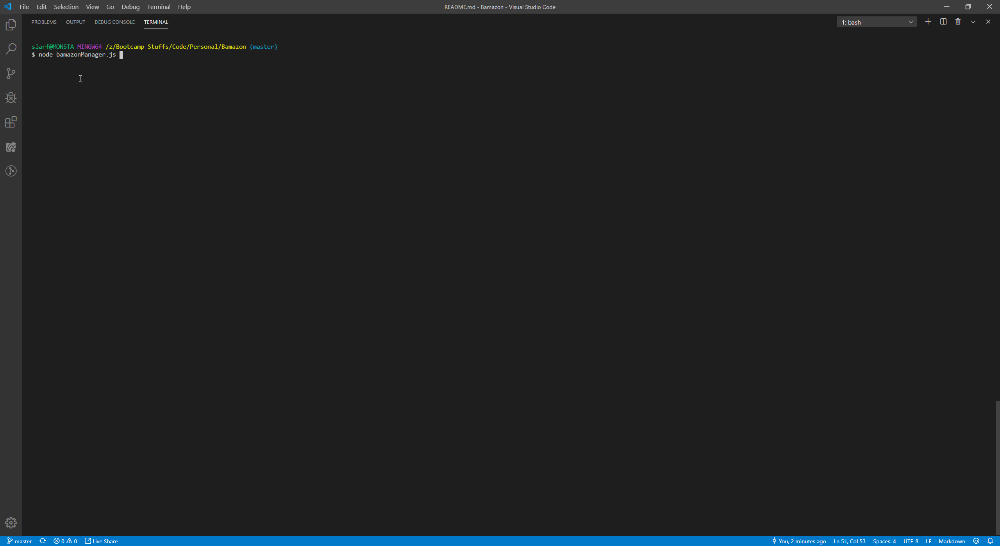
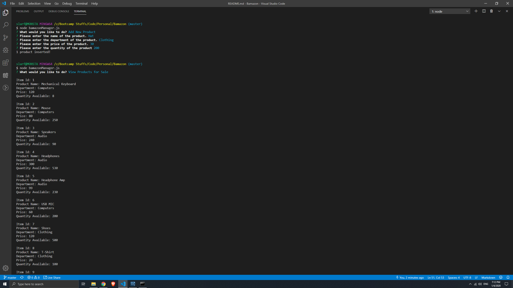
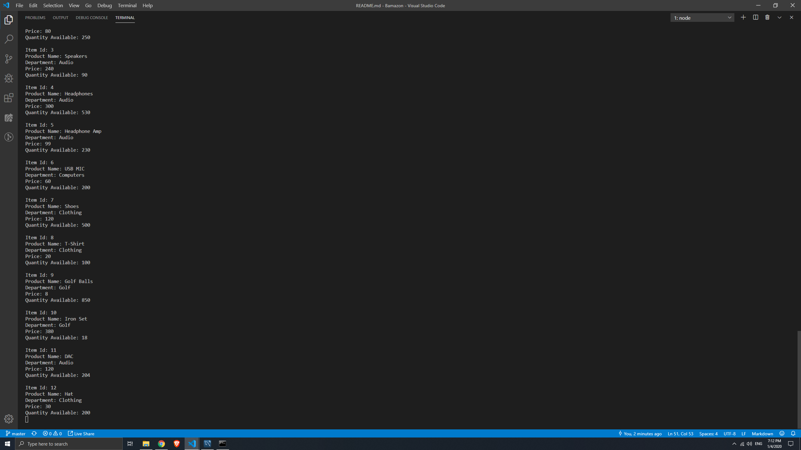

# Bamazon

## What is Bamazon?
Bamazon is a simple online marketplace. It allows for customers to select an item they want to purchase as well as how many and will give a total for their purchase.
It also allows for managers to view products for sale, view low inventory, add to inventory and add new products.

## App Orginzation 

<details><summary>Flow</summary>
<p>

## Customer App

* The app starts by listing all the items for sale according to the mySQL database and asks what the user would like to buy.
* Once the user has decided what they want to purchase they are asked how many they would like to buy.
* If the purchase is successful a total is displayed to the user.
* If the user trys to purchase more items than are available then the program denies the purchase.

## Manager App

* The app starts with an inquirer prompt asking the user what action they would like to perform.

##### View Products for Sale:
* The list of available items is displayed taking data from the mySQL database.

##### View Low Inventory: 
* A list of low inventory items is displayed.
* This list is formulated by checking the database to see which items have a quantity below 5 in this case.

#### Add to Inventory: 
* The user is presented with an inquirer prompt asking them to select and item.
* It then asks how many of the specified item the user would like to add.
* The program takes info from the database and outputs a new total based on user input.

#### Add New Product:
* The user is presented with an inquirer promt asking them to insert data for a new item.
* Each piece of informtaion is stored into a single object and is inserted into the database as a new item.
</p>
</details>


## Gifs showing the app working as intended:

<details><summary>Proofs</summary>
<p>

## Customer App

#### Shows customer successfuly making purchase:


#### Shows the customer requesting more than is available:


## Manager App

#### Shows the manager list function working: 


#### Shows the manager view low inventory function:


#### Shows the manager add to inventory function:


#### Shows add new product function: 




</p>
</details>

## Technologies used: 
* node.js
* javascript
* npm 
* mySQL

## How to run the app: 
In order to run the app you'll need to clone the files in this repo to your machine.
You'll need to install the following npm packages: mysql and inquirer. These can be installed using the npm install command
in the terminal whilst in the root folder. Once setup is complete, run the file by typing ```node bamazonCustomer.js``` or ```node bamazonManager.js``` and inquirer will prompt you from there!

## Roles
I am the only developer who worked on this App.
